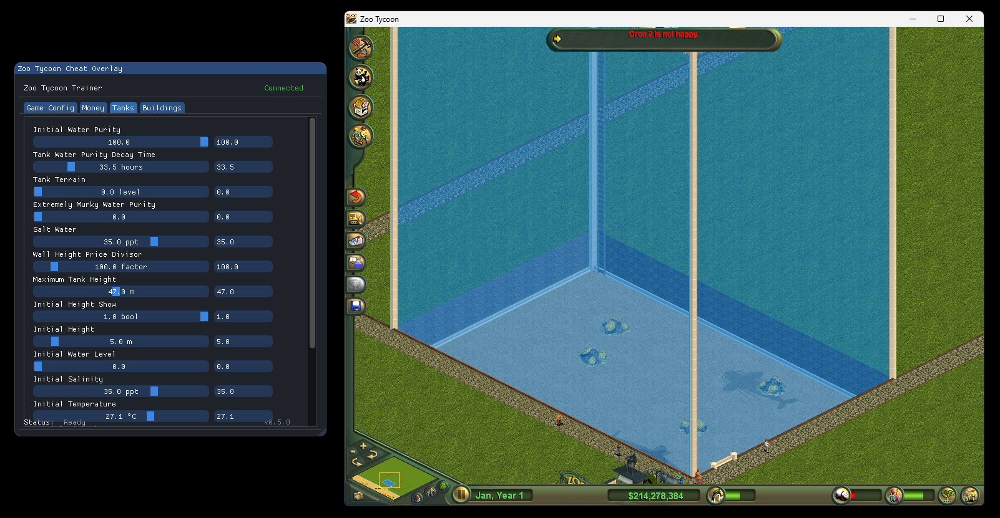

# Zoo Tycoon Cheat Menu

Simple cheat menu for [Zoo Tycoon Complete Collection (2003)](https://github.com/JahsiasWhite/ZooTycoonCompleteCollection-NOCD)

## Installing

### Running the exe (No setup required)

If you don’t want to build the cheat menu yourself, just run one of the prebuilt .exe files included:

- Recommended:

  - `ZooTycoonCheatMenu.exe` 

- Smaller alternative (requires .NET Runtime):

  - `ZooTycoonCheatMenu_WONET.exe` 
    (Much smaller file size, but .NET must already be installed)

### Building the cheat menu

1. Clone this repository.
2. In the /src folder, open the solution (`.sln`) or `Program.cs` in **Visual Studio**.
3. Install all imported packages

- If using Visual Studio, you can install from NuGet Package Manager

4. Set the target platform to **x86**:
   - Go to `Build > Configuration Manager > Platform` and select `x86`
5. Build the project (`Ctrl+Shift+B` or Build > Build Solution)

- Self contained build: `dotnet publish -r win-x86 -c Release --self-contained true -p:PublishSingleFile=true -p:IncludeNativeLibrariesForSelfExtract=true`

## Using cheat menu

1. Start **Zoo Tycoon Complete Collection (2003)** and load into a map
2. Once you're fully in-game, run the cheat menu executable

## Some Features

### Money

- Toggle spending
- Change current money

### General Game Configuration

- Max Guests

### Animal Configuration TODO

- Animals live forever
- No habitat preference needed
- Reproduction chance

### Shelter Configuration TODO

- Capacity

### Fence Configuration TODO

- Invincible Fences
- Strength
- Toggle climbable

#### Marine Mania - Tank & Show Configuration

- Max tank height
- Max show length

## How It Works

This project modifies memory of Zoo Tycoon Complete Collection (2003) at runtime to change gameplay behavior

- Uses WinAPI functions `ReadProcessMemory` and `WriteProcessMemory` to interact with the running game's memory.

- All memory addresses were found with Ghidra and are documented in Offsets.md. These are static values that correspond to specific memory locations in the game.

- The main thread runs ImGui to handle the UI while a background thread handles memory writes/reads
